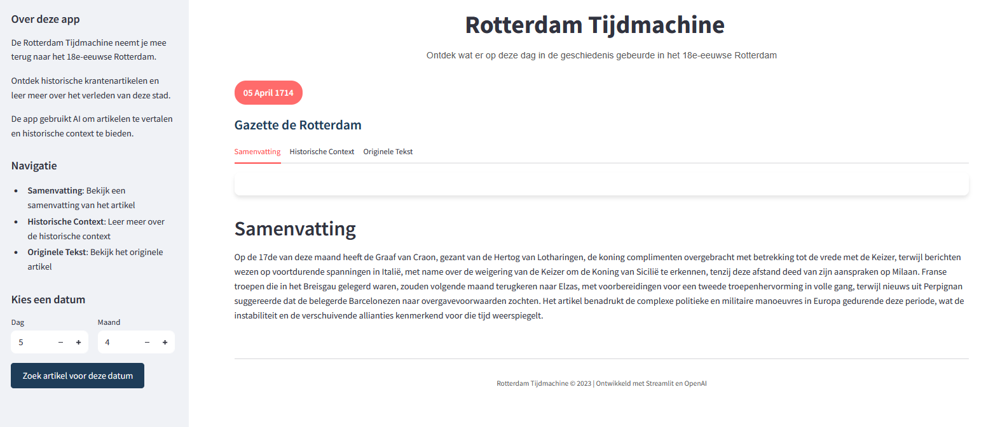

# Rotterdam Time Machine

A web application that allows users to explore >2500 historical newspaper articles published in 18th-century Rotterdam magazines "Gazette de Rotterdam" and "Rotterdam Courant". The application uses AI to translate and summarize articles, providing historical context through Wikipedia integration.



## Project Overview

Rotterdam Time Machine is an interactive web application that brings historical Rotterdam newspapers to life. It features:

- Historical newspaper articles from the 18th century
- AI-powered translation from historical Dutch to modern Dutch
- Automatic article summarization
- Historical context generation using Wikipedia
- Modern, responsive user interface
- Date-based article navigation

## Data Source

The historical newspaper articles featured in this application have been retrieved from [Delpher](https://www.delpher.nl/), an online newspaper archive initiative of the Koninklijke Bibliotheek (National Library of the Netherlands) in The Hague. 

The specific dataset used for this project can be found at:
[https://www.delpher.nl/over-delpher/delpher-open-krantenarchief/download-teksten-kranten-1618-1879/download-teksten-kranten-1770-1779-3-6-gb#baeeb](https://www.delpher.nl/over-delpher/delpher-open-krantenarchief/download-teksten-kranten-1618-1879/download-teksten-kranten-1770-1779-3-6-gb#baeeb)

The >600 GB archive was filtered to include a subset of newspapers from 1700 - 1770 published in Rotterdam newspapers.

## Repository Structure

```
rotterdam_timemachine/
├── app.py                  # Main Streamlit application
├── data/                   # Data processing scripts
│   └── filter_data.py      # Script to filter Rotterdam newspaper articles
├── src/                    # Source code
│   ├── database/          # Database related code
│   │   ├── db.py          # Database connection and operations
│   │   └── models.py      # Database models
│   ├── services/          # External service integrations
│   │   ├── openai_service.py    # OpenAI API integration
│   │   └── wikipedia_service.py # Wikipedia API integration
│   └── utils/             # Utility functions
│       └── date_utils.py  # Date handling utilities
├── tests/                 # Unit tests
│   ├── database/         # Database module tests
│   ├── services/         # Service module tests
│   ├── parsers/          # Parser module tests
│   └── utils/            # Utility module tests
├── prompts/               # AI development prompts
├── run_tests.py          # Test runner script
└── requirements.txt       # Python dependencies
```

## Getting Started

### Prerequisites

- Python 3.8 or higher
- pip (Python package installer)
- OpenAI API key

### Environment Setup

1. Clone the repository:
   ```bash
   git clone https://github.com/yourusername/rotterdam_timemachine.git
   cd rotterdam_timemachine
   ```

2. Create and activate a virtual environment:
   ```bash
   # On Windows
   python -m venv venv
   .\venv\Scripts\activate

   # On macOS/Linux
   python3 -m venv venv
   source venv/bin/activate
   ```

3. Install dependencies:
   ```bash
   pip install -r requirements.txt
   ```

### OpenAI API Key Setup

1. Sign up for an OpenAI account at [https://platform.openai.com](https://platform.openai.com)
2. Generate an API key from your account dashboard
3. Create a `.env` file in the project root directory:
   ```
   OPENAI_API_KEY=your-api-key-here
   ```

## Usage Instructions

1. Start the application:
   ```bash
   streamlit run app.py
   ```

2. The application will open in your default web browser at `http://localhost:8501`

3. Using the application:
   - The sidebar allows you to select a specific date
   - Articles are displayed with their publication date and newspaper name
   - Use the tabs to switch between:
     - Summary: AI-generated summary of the article
     - Historical Context: Wikipedia-based historical information
     - Original Text: The original newspaper article

4. Navigation:
   - Use the date selector in the sidebar to find articles from specific dates
   - If no article exists for the selected date, the app will find the closest available article
   - The interface is fully responsive and works on both desktop and mobile devices

## Features

- **Modern UI**: Clean, responsive design with intuitive navigation
- **AI Translation**: Automatic translation of historical Dutch to modern Dutch
- **Smart Summarization**: Concise summaries of lengthy articles
- **Historical Context**: Wikipedia integration for additional historical information
- **Date Navigation**: Easy browsing of articles by date
- **Error Handling**: Robust error handling and user feedback

## Testing

The project includes a comprehensive test suite using Python's `unittest` framework. The tests cover all major components of the application:

### Test Structure
- **Database Tests**: Testing database operations, connections, and data integrity
- **Services Tests**: Mocked tests for OpenAI and Wikipedia API integrations
- **Parser Tests**: Testing article parsing and metadata extraction
- **Utility Tests**: Testing helper functions and configuration management

### Running Tests

1. Run all tests with coverage reporting:
   ```bash
   python run_tests.py
   ```
   This will:
   - Execute all unit tests
   - Generate a coverage report in the terminal
   - Create a detailed HTML coverage report in `coverage_html/`

2. Run specific test modules:
   ```bash
   python -m unittest tests/database/test_database.py
   python -m unittest tests/services/test_services.py
   ```

### Test Coverage
The test suite aims to maintain high code coverage and includes:
- Unit tests for all major components
- Mocked external API calls
- Edge case handling
- Database operation verification
- Utility function testing

## Development Process

This project was developed using AI-assisted coding tools:

- **Cursor**: An AI-powered IDE that helped with code generation, refactoring, and documentation
- **Lovable**: An AI tool that assisted with development workflow and code improvements

The development process combined:
1. AI-generated code based on prompts (available in the `prompts/` directory)
2. Manual refinements and customizations
3. Iterative improvements through AI-human collaboration

This approach allowed for rapid development while maintaining code quality and implementing best practices. 
